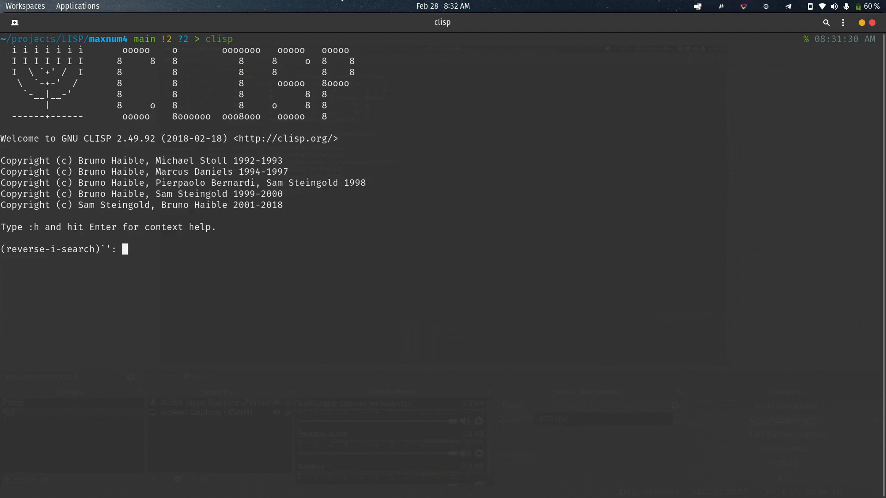
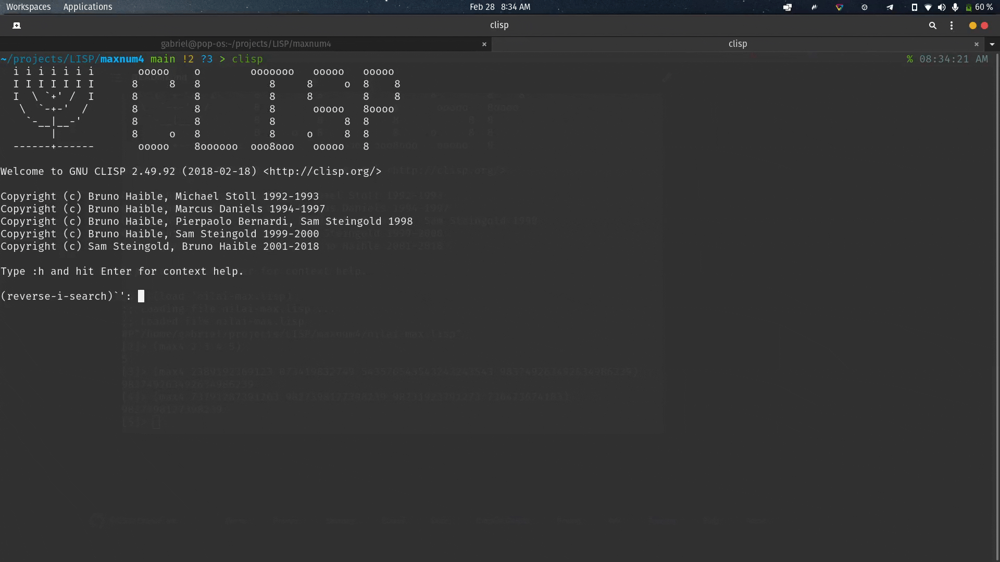

# <b>MAXNUM4</b>

MAXNUM4 is a program created from the Lisp programming language that aims to determine the largest integer value of the 2, 3 or 4 integer number inserted. Click the button below to open the video on youtube for type 1. <br> <br>
There are two versions of this program. Type-2 is a type of development that is easier to use.

<button><a href="https://www.youtube.com/watch?v=-UUtggqNNfg">Click Here</a></button>

## <b> How to use? </b>

Type-1:
1. Open CLISP.
2. Then load this program.
3. Type
   ```
   (max4 v x y z)
   ```
   - With v, x, y and z are numbers that will be compared to each other. In order to be determined which one has the greatest value among them.
4. Type
   ```
   (max2 v x)
   ```
   - With v and x are numbers that will be compared to each other. In order to be determined which one has the greatest value among them.
5. Type
   ```
   (max3 v x y)
   ```
   - With v, x, and y are numbers that will be compared to each other. In order to be determined which one has the greatest value among them.

<br>



Type-2:
1. Open CLISP.
2. Then load this program.
3. Type
   ```
   (max4)
   ```
   Untuk membandingkan empat angka.
4. Type
   ```
   (max2)
   ```
   Untuk membandingkan dua angka.
5. Type
   ```
   (max3)
   ```
   Untuk membandingkan tiga angka.

<br>



## <b>About Me</b>

I'm a student at Del Institute of Technology. <br>
Bachelor of Informatics study program. <br>


<button><a href="https://www.instagram.com/gabrielhtg77/">My Instagram</a></button>
<br>
<button><a href="https://www.del.ac.id/">Institut Teknologi Del</a></button>
